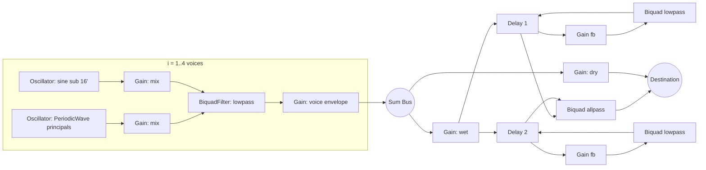
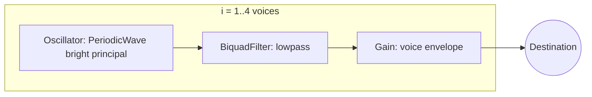
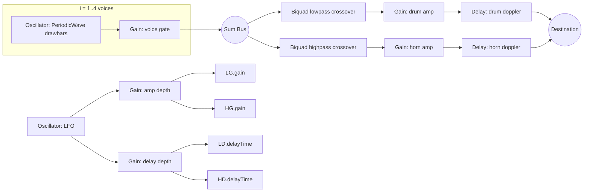

# Web Audio Organ Emulation Under Tight Node Budgets

## Executive summary
Building a convincing organ emulator with only **OscillatorNode, GainNode, BiquadFilterNode, and DelayNode** (and no external samples/buffers) is feasible if you commit to two guiding decisions:

First, emulate “drawbars / stops” primarily with a **single oscillator per voice using `PeriodicWave`**, not with multiple oscillators. That is the only approach that scales to church-organs and tonewheel-style “drawbar organs” within an **~8-nodes-per-voice** budget while still letting you express the characteristic harmonic structures (fundamental + octaves + fifths + mixtures) that make organs sound like organs rather than generic synth pads.

Second, treat the “room” (cathedral bloom) and “rotary speaker” (Leslie-style motion) as **global bus effects**, not per-voice effects. A good global architecture keeps per-voice node counts low and makes mobile performance much more predictable.

Three implementable presets are provided (warm cathedral church organ, brighter small church/positiv organ, and Leslie-emulated electric organ with slow/fast modes). Each recipe includes an exact node graph, concrete parameter values, and explicit node counts.

image_group{"layout":"carousel","aspect_ratio":"16:9","query":["church pipe organ interior pipes close-up","pipe organ facade cathedral","Hammond organ drawbars close up","Leslie rotary speaker horn and drum"],"num_per_query":1}

## Architecture and node budgeting that actually works on mobile
The critical budgeting trick is to keep **voices “dry and cheap”** and put the expensive psychoacoustic cues (space, rotary motion) on a **single shared bus**.

A robust baseline that stays inside your constraints:

- **Per voice (target 4–6 nodes)**: one oscillator (typically `PeriodicWave`), optional second oscillator for sub-octave or mild beating, one envelope gain, optional pre-filter gain(s), one filter.
- **Global bus (target 8–12 nodes)**: either a cathedral-ish diffusion/echo network, or a Leslie-like crossover + modulation + short-delay Doppler approximation.

This fits comfortably inside an overall footprint like:
- 4 voices × 5 nodes = 20 nodes
- global FX = 10–12 nodes
Total ≈ 30–32 nodes.

### Scheduling and click-free retriggering
Organ envelopes are “gate-like” (hold steady while the key is down). Clicks usually come from discontinuities when you jump gain or frequency abruptly. A pragmatic mobile-safe pattern is:

- Keep each voice’s oscillators **running continuously** after initialization.
- For note on/off, automate only the **voice gain** (and optionally a subtle filter transient).
- When stealing voices, ramp the stolen voice to near-zero quickly (5–15 ms), retune, then ramp back up.

Use these automation principles consistently:
- Always call `cancelScheduledValues(now)` (or cancel-and-hold equivalent) before setting new ramps on the same AudioParam when retriggering.
- Use **short linear ramps** for gain to avoid clicks (even 3–10 ms is enough).
- Use **`setTargetAtTime`** for “motor inertia” (Leslie speed changes) and for gentle decays that aren’t strictly linear.

## Tone generation: drawbars and additive stops with minimal nodes
### Why `PeriodicWave` is the drawbar “cheat code”
A real drawbar organ is effectively additive synthesis: you mix specific harmonic components (and a few non-octave components) in controlled ratios. Reproducing this with one oscillator per harmonic is impossible under your node budget, but a single oscillator with a precomputed `PeriodicWave` can synthesize a custom harmonic spectrum at essentially the cost of one oscillator node per voice.

The key conceptual mapping:

- `PeriodicWave` partial index *n* corresponds to the **n-th harmonic** of the oscillator’s fundamental frequency.
- You choose the fundamental so that the harmonics you need land at integer multiples.

#### Mapping tonewheel-style drawbars to harmonics
The classic 9 drawbars (often labeled by “footage”) correspond to frequency ratios relative to the played pitch that include sub-octave and fifth components. A practical way to represent all of them as integer harmonics is:

- Set oscillator frequency to **half of the played pitch**:
  `osc.frequency = noteHz / 2`.
- Then the drawbar components become integer partials:
  - 16′ (sub octave) → 1st harmonic
  - 8′ (unison) → 2nd harmonic
  - 5⅓′ (fifth) → 3rd harmonic
  - 4′ (octave) → 4th harmonic
  - 2⅔′ → 6th harmonic
  - 2′ → 8th harmonic
  - 1⅗′ → 10th harmonic
  - 1⅓′ → 12th harmonic
  - 1′ → 16th harmonic

That gives you a compact, implementable harmonic recipe without needing multiple oscillators.

### Filters for “pipe-like” tone with one filter per voice
With only one `BiquadFilterNode` per voice, think in terms of coarse timbral families:

- **Flute / gedackt-ish**: strong fundamental, fast harmonic rolloff → keep waveform harmonics sparse; use a fairly open low-pass with low Q.
- **Principal (diapason)**: more upper harmonics → richer `PeriodicWave`; slightly lower cutoff to avoid harshness.
- **Mixture brightness** (sparkle): add higher harmonics in the wave, not by opening the filter too far (opening the filter often makes things synth-buzzy instead of organ-bright).

A practical “pipe organ shaper” filter default:
- `type = "lowpass"`
- `Q = 0.6–1.0`
- cutoff adjusted per preset (see recipes).

If you need a brief “speech/chiff” cue without noise, fake it by a **very short cutoff overshoot** at note-on (e.g., open cutoff for 15–40 ms then settle).

## Envelope and voice behavior: what makes an organ feel like an organ
### Envelopes are not ADSR pads; they’re gated with anti-click ramps
The canonical organ behavior is:
- near-instant onset (but not a sample-accurate step),
- constant sustain while held,
- relatively quick release,
- legato should not “re-articulate” harshly if you reuse a voice (especially under 4-voice limits).

A mobile-safe organ envelope baseline:
- Attack: **5–15 ms** (linear ramp for gain)
- Hold/Sustain: constant 1.0 while key is down
- Release: **25–120 ms** depending on pipe vs electric organ voicing

If you want cathedral bloom, do it with **global space**, not a huge release. Huge releases blur voice stealing and make 4-voice polyphony feel worse.

### Note stealing strategy under 4 voices
Under strict 4-voice polyphony, you must decide how to steal voices. For organ-like playability:
- Prefer stealing the **quietest** voice if you’re doing any release overlap.
- Else steal the **oldest** currently-held voice.
- Always ramp gain down quickly before retuning to prevent a pitch “zip” click.

A practical heuristic:
1. If any voice is in release and below -30 dB (gain < ~0.03), reuse it immediately.
2. Else steal the oldest voice, but ramp it down over 10 ms, retune, ramp up over 10 ms.

## Leslie-style rotary speaker emulation within the allowed nodes
A believable Leslie impression typically comes from three cues:
- **tremolo/amplitude modulation** (sound gets louder/softer as the rotor points toward/away),
- **Doppler pitch modulation** (short time-varying delay is a practical digital approximation),
- **band-dependent motion** (horn dominates highs; drum dominates lows).

Your constraint set removes two common stereo tools:
- You explicitly excluded `StereoPannerNode`.
- You also constrained the node list; that effectively prevents using ChannelSplitter/Merger for true stereo auto-pan.

So the recipes below implement a **mono rotary approximation** (still very recognizable), and include an optional “if you later allow stereo routing nodes” note.

### Practical speed ranges and inertia
A Leslie has a slow “chorale” and fast “tremolo” mode; a musically useful mapping for Web Audio LFOs:
- chorale: **~0.7–0.9 Hz**
- tremolo: **~5.5–6.8 Hz**
- ramp time (motor inertia): **~0.7–2.5 seconds** depending on how dramatic you want it.

Use `setTargetAtTime` on `lfo.frequency` to glide between speeds rather than stepping.

### Doppler approximation with DelayNode
A time-varying delay line creates pitch modulation. Keep it subtle:
- Base delay: **4–8 ms**
- Mod depth: **0.6–2.0 ms**
- Use different base/depth for horn vs drum bands (horn usually “spins faster” perceptually).

Avoid modulating delay in a feedback loop here; you want clean modulation, not flanger chaos.

## Tradeoffs: realism vs node cost vs CPU
| Technique | Realism potential | Node cost | CPU risk on mobile | Notes |
|---|---:|---:|---:|---|
| Single `PeriodicWave` oscillator per voice | High for drawbar-ish harmonic identity | Very low | Low | Best “organ per node” ratio; no per-harmonic oscillators needed. |
| Multiple oscillators per harmonic (“true additive”) | Very high | Extremely high | High | Not feasible under 8 nodes/voice beyond 2–3 partials. |
| One filter per voice (lowpass) + wave design | Medium–high | Low | Low | Use `PeriodicWave` to “bake” brightness; filter mainly removes harshness. |
| Global cathedral diffusion using 2 feedback delays + allpass | Medium | Moderate | Medium | Good bloom without impulse responses; keep feedback modest to avoid mud. |
| Global Leslie mono: crossover + AM + modulated delay | High (recognizable) | Moderate | Medium | Strong character even without stereo pan if tuned carefully. |
| True stereo Leslie (needs splitter/merger or panner) | Very high | Moderate | Medium | Not allowed in strict node list; optional later upgrade. |

## Presets and exact recipes
The recipes below assume:
- sample rate is device-dependent,
- all base gains are chosen conservatively to avoid clipping with **4 voices**, because you do not have a compressor/limiter in the allowed node set.

A small recipe comparison table is included first, then each recipe is specified in detail.

| Recipe | Core sound | Per-voice nodes | Global nodes | Total nodes (4 voices + global) | Best for |
|---|---|---:|---:|---:|---|
| Warm cathedral church organ | Foundation + gentle mixtures + bloom | 6 | 8 | 32 | Hymns, sustained chords, “big room” |
| Small church / positiv organ | Brighter principals, tighter room | 5 | 0–2 | 20–22 | Baroque lines, clarity |
| Leslie electric organ | Drawbar tonewheel-ish + rotary motion | 4 | 10 | 26 | Pop/soul organ comps, motion |

### Warm cathedral church organ
**Goal:** warm foundation with a subtle bright edge and a cathedral-style bloom using only delay+filter diffusion.

#### Node graph


#### Per-voice node count
- 2× OscillatorNode (OSC1, OSC2)
- 2× GainNode (VM1, VM2)
- 1× BiquadFilterNode (VF)
- 1× GainNode (VE)
**Total per voice: 6 nodes** → **4 voices = 24 nodes**

#### Global node count
- dry gain (1)
- wet gain (1)
- two feedback delays: 2× DelayNode (2)
- two feedback gains: 2× GainNode (2)
- two damping filters: 2× BiquadFilterNode (2)
- one diffusion allpass: 1× BiquadFilterNode (1)
**Total global: 9 nodes**

This totals 33 nodes; if you need to hard-cap at 32, remove the allpass diffusion and keep only the dual damped feedback delays (global becomes 8 nodes).

#### Exact parameter values
**Per voice**
- OSC1: `PeriodicWave` “warm principal + gentle mixture”
  - `osc1.frequency = noteHz`
  - Harmonic amplitudes (partial → amplitude), normalized later:
    - 1: 1.00 (8′ foundation)
    - 2: 0.42 (4′ octave)
    - 3: 0.18 (12th-ish flavor)
    - 4: 0.10 (2′)
    - 5: 0.06
    - 6: 0.05
    - 8: 0.03
  - Implementation note: build arrays up to at least 16 partials; put amplitudes in `imag[n]`.
- OSC2: `type = "sine"`
  - `osc2.frequency = noteHz / 2`
  - `osc2.detune = 0`
- Mix gains:
  - VM1.gain = 0.55
  - VM2.gain = 0.30
- Voice filter VF:
  - `type = "lowpass"`
  - `frequency = 4200 Hz`
  - `Q = 0.75`
- Voice envelope VE (gate-like):
  - On note-on:
    - VE.gain: ramp from 0 → 1 over **0.012 s**
  - While held: VE.gain = 1
  - On note-off:
    - VE.gain: ramp to 0 over **0.080 s**
- Optional chiff (subtle, no extra nodes): on note-on, briefly open VF cutoff:
  - set VF.frequency to 6200 Hz at note-on, then linear ramp down to 4200 Hz over 0.030 s

**Global cathedral bloom (if using dual delays only)**
- DRY.gain = 0.78
- WET.gain = 0.22
- Delay 1:
  - D1.delayTime = 0.061 s
  - FB1.gain = 0.33
  - LP1: lowpass 2900 Hz, Q 0.3
- Delay 2:
  - D2.delayTime = 0.089 s
  - FB2.gain = 0.28
  - LP2: lowpass 2400 Hz, Q 0.3
- Optional diffusion allpass (if you keep it):
  - AP.type = "allpass"
  - AP.frequency = 1400 Hz
  - AP.Q = 0.7

**Gain staging**
- Rendered output target: keep per-voice peak around **-16 to -12 dBFS**.
- Start with VE.gain peak scaled so that four-note chords do not exceed unity at the destination. If necessary, cap VE.gain at ~0.22–0.28 per voice (or reduce VM gains).

### Small church / positiv organ
**Goal:** brighter, clearer, less bloom; a “small room” organ that reads articulate and slightly reedy without becoming synth-buzzy.

#### Node graph


#### Node counts
Per voice:
- 1 oscillator + 1 filter + 1 envelope gain = **3 nodes**
Optionally add one pre-gain to rebalance levels per preset = **4 nodes**
With 4 voices: 12–16 nodes total. No global FX required.

#### Exact parameter values
**Per voice**
- OSC: `PeriodicWave` “positiv principal”
  - `osc.frequency = noteHz`
  - Partial amplitudes:
    - 1: 1.00
    - 2: 0.55
    - 3: 0.26
    - 4: 0.18
    - 5: 0.10
    - 6: 0.08
    - 7: 0.05
    - 8: 0.05
    - 10: 0.03
- VF:
  - type: lowpass
  - frequency: **6800 Hz**
  - Q: **0.55**
- VE (more immediate than cathedral):
  - attack: **0.008 s**
  - release: **0.045 s**
- Optional micro “speech” cue (still no extra nodes):
  - VF.frequency overshoot to 8200 Hz, ramp back to 6800 Hz over 0.020 s

**Gain staging**
- Because this wave is brighter and denser, reduce VE peak:
  - VE max gain ≈ **0.18–0.22 per voice** for safe 4-note chords.

### Leslie-emulated electric organ with slow/fast rotor modes
**Goal:** recognizably “electric organ through rotary speaker” motion using a single global LFO, crossover filters, amplitude modulation, and time-varying short delays for Doppler cues—implemented in mono under the strict node list.

#### Node graph


#### Node counts
Per voice:
- 1× OscillatorNode
- 1× GainNode (voice gate)
**2 nodes per voice** → 4 voices = 8 nodes

Global:
- crossover filters: 2× BiquadFilterNode = 2
- band amp gains: 2× GainNode = 2
- doppler delays: 2× DelayNode = 2
- LFO oscillator: 1
- modulation scalers: 2× GainNode = 2
**Total global = 9 nodes**

Overall: **17 nodes**. This is very safe for mobile.

#### Electric organ drawbar wave (single oscillator)
Use the integer-harmonic trick by halving the base frequency:

- `osc.frequency = noteHz / 2`
- Build a `PeriodicWave` with non-zero partials at: 1, 2, 3, 4, 6, 8, 10, 12, 16.

A baked-in “classic comping” drawbar-ish balance (normalized later):
- 1: 0.58  (16′)
- 2: 0.95  (8′)
- 3: 0.55  (5⅓′)
- 4: 0.62  (4′)
- 6: 0.28  (2⅔′)
- 8: 0.24  (2′)
- 10: 0.16 (1⅗′)
- 12: 0.12 (1⅓′)
- 16: 0.08 (1′)

**Optional warmth without extra nodes:** keep higher partials (10/12/16) slightly lower than above; rotary motion will add brightness perception anyway.

#### Voice gate envelope (electric organ feel)
- Attack: **0.006 s**
- Release: **0.030 s**
- No decay/sustain stage: it’s a gate normalized to 1.0.

If you want a tiny “key click” cue without noise nodes, you can do a brief (5–10 ms) gain overshoot (e.g., 1.0 → 1.06 → 1.0), but be careful: overshoots can clip with multiple voices.

#### Leslie parameters (slow/fast modes)
**Crossover**
- XLP: lowpass, frequency **800 Hz**, Q **0.7**
- XHP: highpass, frequency **800 Hz**, Q **0.7**

**Amplitude modulation**
Set base gains so LFO modulation never drives gain negative:

- LG.gain base = 0.72
- HG.gain base = 0.58

Then add LFO-scaled modulation:
- AMPDEPTH.gain = 0.22
  (This means ±0.22 added to each band gain via the AudioParam sum. With bases above, gains stay > 0.)

**Doppler (time-varying delay)**
Choose base delay and modulation depth:
- Drum delay (LD):
  - base delayTime = **0.0070 s**
- Horn delay (HD):
  - base delayTime = **0.0045 s**
- DELDEPTH.gain = **0.0011**
  (±1.1 ms modulation depth)

These are intentionally small; too much delay modulation turns into obvious chorus or pitch wobble rather than rotary Doppler.

**Rotor speeds**
Use one LFO frequency and switch it:

- Slow (chorale): `lfo.frequency = 0.80 Hz`
- Fast (tremolo): `lfo.frequency = 6.30 Hz`

**Inertia / ramping**
When switching modes:
- ramp LFO frequency using `setTargetAtTime` with timeConstant:
  - slow→fast: **0.35–0.55 s**
  - fast→slow: **0.65–1.20 s**

Also increase intensity on fast:
- AMPDEPTH.gain:
  - slow: 0.18
  - fast: 0.26
- DELDEPTH.gain:
  - slow: 0.0007
  - fast: 0.0013

This mirrors the perception that fast rotor is not only faster but more intense.

**Optional enhancement if you ever relax the strict node list**
If later you allow stereo routing nodes (ChannelSplitter/Merger or a dedicated panner), you can create true autopan by sending horn and drum bands into left/right paths with phase-offset LFOs. Under the strict allowlist, treat this as intentionally mono.

## Implementation patterns and code notes
### Efficient `PeriodicWave` construction pattern (shared across voices)
Create one wave per preset. Reuse it across voices:

- Build `Float32Array` for `real` and `imag` of length `maxPartial + 1` (index 0 unused for DC).
- Put amplitudes into `imag[n]` and leave `real[n] = 0` for a simple sine-phase harmonic stack.
- Normalize manually (recommended) by scaling the amplitudes so their weighted sum doesn’t clip after mixing.

Recommended normalization approach for baked presets:
- Compute `sumAbs = Σ amplitude[n]`.
- Scale all partial amplitudes by `1 / (sumAbs * 1.8)` as a conservative starting point.
- Then set per-voice gain so 4 voices remain clean.

### Routing one LFO to many targets without extra nodes
Use **one LFO oscillator** and separate **depth GainNodes** per unit family (amp depth vs delay depth vs vibrato depth). This keeps node count low and makes “mode switching” easy: you only automate a few depth gains and the LFO rate.

### Core automation snippet pattern (pseudo-code)
```js
function ramp(param, now, value, t) {
  param.cancelScheduledValues(now);
  param.setValueAtTime(param.value, now);
  param.linearRampToValueAtTime(value, now + t);
}

function setMotor(param, now, targetHz, timeConstant) {
  param.cancelScheduledValues(now);
  param.setTargetAtTime(targetHz, now, timeConstant);
}
```

### Mobile performance and stability tips
- Create one `AudioContext` and reuse it; create voices and global graph once, then only automate AudioParams.
- Use short ramps (>= 5 ms) for gain changes; treat “instant” changes as a click risk.
- Avoid large mod depths on `delayTime`. Time-varying delay is moderately CPU-expensive and can glitch if pushed too hard on older devices.
- Keep global feedback coefficients modest (< ~0.4) and damp high frequencies in feedback loops to prevent metallic ringing and runaway energy.

## Appendix: baked-in preset data blocks

### PeriodicWave partial tables (copy/paste friendly)

**Warm cathedral principal wave (OSC1)**
```txt
partials:
  1: 1.00
  2: 0.42
  3: 0.18
  4: 0.10
  5: 0.06
  6: 0.05
  8: 0.03
```

**Positiv principal wave**
```txt
partials:
  1: 1.00
  2: 0.55
  3: 0.26
  4: 0.18
  5: 0.10
  6: 0.08
  7: 0.05
  8: 0.05
  10: 0.03
```

**Electric organ drawbar wave (noteHz/2 fundamental)**
```txt
partials:
  1: 0.58
  2: 0.95
  3: 0.55
  4: 0.62
  6: 0.28
  8: 0.24
  10: 0.16
  12: 0.12
  16: 0.08
```

## Source-minded notes
This report is designed to be implementable directly in vanilla Web Audio. To validate specifics against primary references, consult (by topic) the official Web Audio spec and platform documentation from entity["organization","World Wide Web Consortium","web audio spec publisher"], implementation documentation from entity["organization","Mozilla","mdn publisher"] / entity["organization","MDN Web Docs","web platform docs"], and platform notes from entity["company","Apple","ios safari platform vendor"]; for organ/Leslie historical grounding, reference materials related to entity["company","Hammond Organ Company","electromechanical organs"] and entity["people","Donald Leslie","rotary speaker inventor"].
